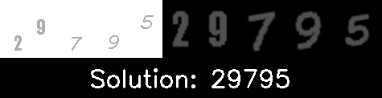

# OCR Challenge Solver


## Table of Contents
- [OCR Challenge Solver](#ocr-challenge-solver)
  - [Table of Contents](#table-of-contents)
  - [Introduction](#introduction)
  - [Features](#features)
  - [Requirements](#requirements)
  - [Installation](#installation)
  - [Usage](#usage)
  - [Example outputs](#example-outputs)
  - [Limitations and Future Improvements](#limitations-and-future-improvements)
  - [How It Works](#how-it-works)
  - [License](#license)
  - [Why this project?](#why-this-project)

## Introduction

This project aims to solve a simple OCR challenge like this one: 


The challenge consists of a series of skewed and distorted digits that are often found on websites like [Myntra](https://www.myntra.com/) (the captcha can be generated using the endpoint https://www.myntra.com/gateway/v1/captcha), as well as other smaller websites.

## Features

- Automatically detects and extracts digits from a given OCR challenge image
- Corrects skew and distortion for improved digit recognition
- Employs Tesseract OCR for accurate digit reading
- Delivers the OCR challenge solution as a cohesive string of digits
- Demonstrates a high success rate, with only minor issues related to the digit "7"

## Requirements

- Python 3.6 or later
- OpenCV
- Tesseract OCR
- pytesseract

## Installation

1. Clone the repository:
```
git clone https://github.com/glizzykingdreko/ocr-challenge-solver.git
```
2. Install the required dependencies:
```
pip install -r requirements.txt
```

3. Install Tesseract OCR following the instructions for your platform:

- [Windows](https://github.com/UB-Mannheim/tesseract/wiki)
- [macOS](https://tesseract-ocr.github.io/tessdoc/Home.html#macos)
- [Linux](https://tesseract-ocr.github.io/tessdoc/Home.html#linux)

## Usage

```python
from ocr_reader import OcrReader

# Create an instance of the OcrReader class
ocr_reader = OcrReader(base64image)

# Solve the challenge
solution = ocr_reader.solve()

# Print the solution
print(solution)
```

For debugging purposes, you can pass debug=True to the constructor:
```python
from ocr_reader import OcrReader

# Create an instance of the OcrReader class with debug=True
ocr_reader = OcrReader(base64image, debug=True)

# Solve the challenge
solution = ocr_reader.solve()

# Print the solution
print(solution)

# The debug image will be saved as `solved_<solution>.png`
```

## Example outputs

Here are some example outputs:

- 
- 
- 
- 

## Limitations and Future Improvements
While the current implementation serves its purpose effectively for most use cases, there are some limitations:

The model may misread the digit "7" as "1" when there is only one "7" in the number
- The solution does not utilize deep learning or AI techniques, such as TensorFlow, due to the simplicity of the challenges
- As the success rate is already high, these limitations may not be a concern for your immediate needs. 

However, should you require more advanced functionality, potential future improvements could address these limitations and achieve a 100% success rate.

## How It Works
The OCR Challenge Solver functions by first detecting and extracting digits from the input image. It then corrects skew and distortion, enabling Tesseract OCR to read the digits with greater accuracy. The solution is then output as a string of digits.

For a deeper understanding of the inner workings of this project, please refer to the [LEARN.md](./LEARN.md) file.

## License
This project is licensed under the [MIT License](./LICENSE).

## Why this project?
This project is a really first attempt at solving a real-world problem using Python as well as a way to learn more about OpenCV and Tesseract OCR. I hope you find it useful! It could be used as a starting point for your own OCR challenge solver, or as a reference for your own projects or for even more advanced OCR challenges.

If you have any questions or suggestions, feel free to reach out to me. 
- [Twitter](https://twitter.com/glizzykingdreko)
- [GitHub](https://github.com/glizzykingdreko)
- [glizzykingdreko@protonmail.com](mailto:glizzykingdreko@protonmail.com)

Checkout my Medium blog for more articles on Python and other topics: [glizzykingdreko](https://medium.com/@glizzykingdreko).